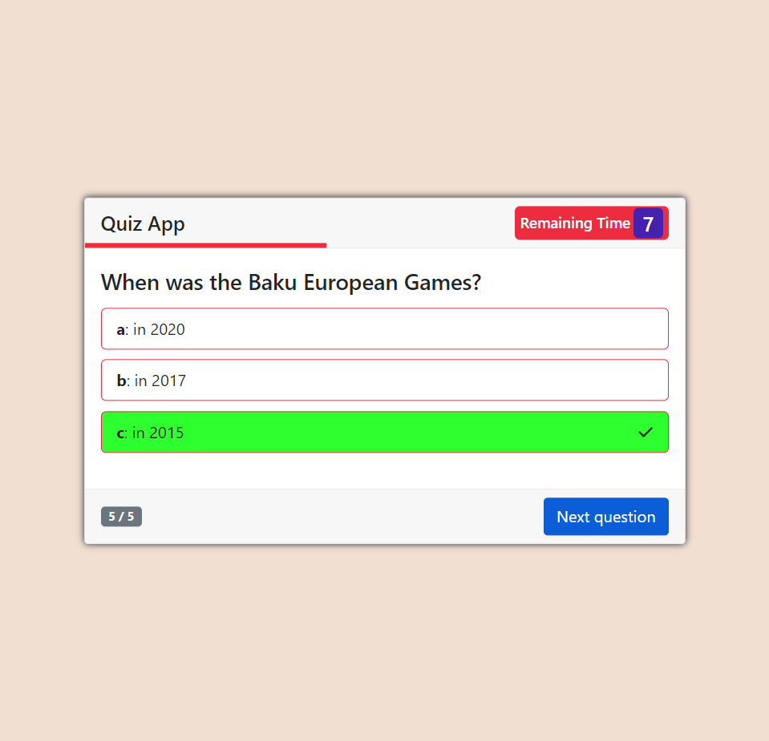

# JavaScript Quiz App

This is a JavaScript quiz application that allows users to test their knowledge on a variety of topics.

## Features

- Multiple-choice questions
- Feedback on correct and incorrect answers
- Option to review answers at the end of the quiz

## Installation

To use this app, simply download or clone the repository to your local machine and open the index.html file in your web browser.

Alternatively, you can also access the live demo of the app [here](https://rm-quiz-app.netlify.app/)

## How to use

1. Click the "Start Quiz" button.
2. Answer each question by clicking on one of the multiple-choice options.
3. Click the "Next Question" button to move on to the next question.
4. Continue answering questions until the end of the quiz.
5. At the end to see your score.
6. You can play again and also quit game.

## Customization

You can customize the questions by editing the "question.js" file. Add or remove questions as desired.

## Technologies Used

This application was built using:

- HTML
- CSS
- BootStrap
- JavaScript

## Contributing

If you'd like to contribute to this project, please follow these steps:

1. Fork the repository
2. Create a new branch (git checkout -b feature/your-feature-name)
3. Commit your changes (git commit -am 'Add some feature')
4. Push to the branch (git push origin feature/your-feature-name)
5. Create a new pull request

## License

This project is licensed under the MIT License - [MIT](https://choosealicense.com/licenses/mit/)
